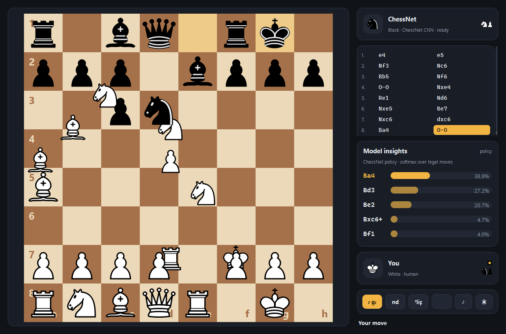

# ChessNet — Play the CNN

A polished desktop UI (PySide6) for the supervised chess CNN in this repo.
Play against the trained `ChessNet` model, watch its policy live, review
games, and more. The old tkinter GUI (`chess_gui.py`) still works too.



## Run

```bash
pip install -r requirements.txt
python chess_app.py          # dark theme
python chess_app.py --light  # light theme
```

The first launch warm-loads the 86MB checkpoint in a background thread —
the window appears immediately.

## Features

- **Board**: SVG pieces (cburnett set), drag & drop *or* click-to-move,
  legal-move dots, capture rings, last-move + check highlights, smooth
  animated moves (with capture fades and castling), promotion picker.
- **Model insights**: after every AI reply, the panel shows the model's
  top-5 candidate moves with animated softmax probability bars — you can
  literally watch the network's policy.
- **Move list**: numbered SAN moves; click any move (or use ←/→, Esc for
  live) to review earlier positions.
- **Player cards**: avatars, captured pieces, material advantage,
  turn indicator, "thinking" state.
- **Play options**: choose White / Black / Random; Greedy vs Sampling
  AI mode; undo (full move pair); board flip.
- **Themes**: dark (default) and light, toggle live.
- **Sounds**: move / capture / check / game-end, synthesized at startup
  (no asset files). Toggle with the ♪ button.
- AI inference runs on a worker thread — the UI never freezes.

## Keyboard

| Key      | Action                    |
|----------|---------------------------|
| Ctrl+N   | New game                  |
| Ctrl+Z   | Undo move pair            |
| ← / →    | Step through game history |
| Esc      | Back to live position     |
| F        | Flip board                |

## How the model plays

`chess_ai.py` runs one forward pass per move: the board is encoded as 15
one-hot 8×8 planes — 12 piece planes plus castling rights and the
en-passant target square (`chess_utils.board_to_tensor`). `ChessNet`
outputs 4096 logits (from-square × to-square), which are softmaxed over
**legal moves only**. **Greedy** mode plays the argmax; **Sampling** mode
draws from the distribution. The same pass yields the top-5 shown in the
insights panel.

## Model performance

Trained on ~20k Lichess games (1.08M positions, players rated 1200+),
predicting the human move from the position, with legal-move masking
during training and a strict game-level validation split (870 games the
model never saw):

| Metric | Score |
|---|---|
| Top-1 accuracy | **40.9%** |
| Top-5 accuracy | **76.6%** |

In other words: 3 out of 4 human moves are among the model's five best
guesses. (A pre-upgrade baseline — 4k games, no masking, leaky split —
reached 32.4% top-1.)

## Training pipeline

```bash
python prepare_data.py   # all games.csv -> chess_data.npz (positions,
                         # legal-move lists, game ids)
python train.py          # masked training -> chess_model_best.pth
```

- `prepare_data.py` replays every game with python-chess, encoding each
  position as a 15-plane tensor and recording the full legal-move list.
- `train.py` trains with masked cross-entropy (illegal moves get −1e9
  logits), early-stops on validation top-1, and splits by game — never
  by position — so validation is leakage-free.

## Screenshot mode

```bash
python chess_app.py --screenshot out.png --plies 16 [--light]
```

Renders the window after scripted model-vs-model plies and exits.

## Credits

- Piece art: [cburnett](https://commons.wikimedia.org/wiki/Category:SVG_chess_pieces)
  (CC BY-SA 3.0), embedded in `ui/pieces.py` and `ui/assets/`.
- Chess rules: [python-chess](https://github.com/niklasf/python-chess).
